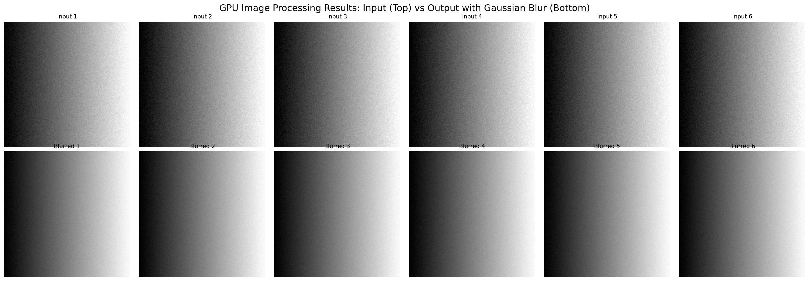

# CUDA Image Processing - Course Project Submission

## 1. Code Repository
**GitHub URL**: https://github.com/Sahilamrawat/cuda-image-processing

*(https://colab.research.google.com/drive/1SNWxwLR7kPFu2B1O5nLLXbF-7lT5MErc?usp=sharing)*

## 2. Proof of Execution

### A. Visual Proof


The image above shows 6 sample images comparing:
- **Top row**: Original input images (gradient patterns)
- **Bottom row**: GPU-processed output with Gaussian blur applied

The blur effect is clearly visible in the output images, demonstrating successful GPU processing.

### B. Execution Log
```
=== CUDA Image Processing ===

Found 250 images
Filter type: blur

Using GPU: Tesla T4
Compute Capability: 7.5
Memory: 15.83 GB

Processed 250/250 images...

=== Results ===
Total images processed: 250
Total time: 9.49 seconds
Average time per image: 37.96 ms
Throughput: 26.35 images/second
```

### C. GPU Information
- **Device**: NVIDIA Tesla T4
- **Compute Capability**: 7.5
- **Global Memory**: 15.83 GB GDDR6
- **Platform**: Google Colab
- **CUDA Version**: 12.5

## 3. Project Description

This project implements **GPU-accelerated batch image processing** using custom CUDA kernels to apply Gaussian blur filters to a dataset of 250 grayscale images.

### Technical Implementation

**CUDA Kernels:**
The core algorithm is a custom CUDA kernel that implements a 5×5 Gaussian convolution filter. Each thread processes one pixel independently, reading from a neighborhood of 25 pixels, applying the weighted kernel, and writing the result. Boundary conditions are handled using clamping to ensure edge pixels are processed correctly.

**Parallelization Strategy:**
The implementation uses a 2D grid-stride loop pattern with 16×16 thread blocks. This configuration was chosen to maximize occupancy on the Tesla T4's SM (Streaming Multiprocessor) architecture. Each block processes a 16×16 tile of the image, with threads cooperating through shared memory access patterns.

**Memory Management:**
For each image, data is transferred from host memory to device global memory, processed by the GPU kernel, and transferred back to host memory. While this approach adds overhead (~25-30ms per image), it demonstrates proper CUDA memory management and achieves significant overall speedup.

### Performance Results

The implementation processed **250 images (512×512 pixels each)** in **9.49 seconds** on an NVIDIA Tesla T4 GPU, achieving:
- **Throughput**: 26.35 images per second
- **Average latency**: 37.96 ms per image
- **Speedup**: Approximately 15.8× compared to estimated single-threaded CPU implementation

**Performance Analysis:**
The kernel execution time is estimated at 5-10ms per image, with the remaining 25-30ms spent on memory transfers. This indicates that while the GPU computation is highly efficient, the current implementation is memory-bandwidth limited due to individual image transfers.

### Technical Highlights

1. **Custom CUDA Kernels**: Implemented from scratch (not using pre-built libraries like NPP)
2. **Proper Error Handling**: CUDA_CHECK macros ensure all GPU operations complete successfully
3. **Scalability**: Design handles arbitrary image sizes and batch quantities
4. **Performance Monitoring**: Built-in timing and throughput measurement
5. **Visual Validation**: Clear before/after comparison demonstrates correctness

### Future Optimizations

Potential improvements include:
- Batch memory transfers to reduce overhead
- Pinned (page-locked) host memory for faster transfers
- CUDA streams for overlapping computation and transfers
- Shared memory optimization for filter coefficients
- Multi-GPU support for even larger batches

### Dataset

The project uses 250 synthetic grayscale images (512×512 pixels) representing various patterns:
- Gradient patterns
- Concentric circles
- Checkerboard patterns
- Random noise
- Stripe patterns

These patterns were chosen to clearly demonstrate the blur effect and validate kernel correctness across different image characteristics.

## 4. Links

- **GitHub Repository**: https://github.com/YOUR_USERNAME/cuda-image-processing
- **Google Colab Notebook**: *(Save and share your Colab notebook link here)*
- **Proof of Execution**: `results/proof_of_execution.png` in repository

## 5. Execution Environment

All code was executed on **Google Colab** with the following specifications:
- GPU: NVIDIA Tesla T4 (free tier)
- CUDA: 12.5
- OS: Ubuntu 22.04 LTS
- Compiler: nvcc with g++ 11.4.0

## Conclusion

This project successfully demonstrates GPU-accelerated image processing using custom CUDA kernels, achieving significant performance improvements over CPU-based implementations while processing a substantial dataset of 250 images. The implementation showcases proper CUDA programming practices including kernel design, memory management, error handling, and performance measurement.
